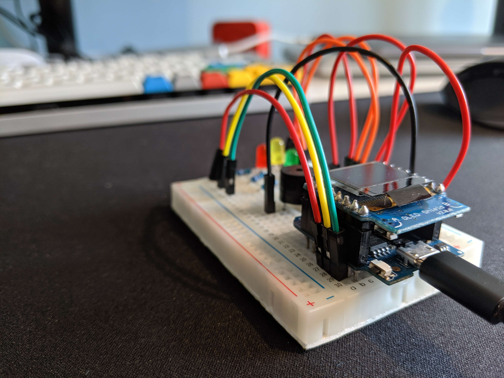
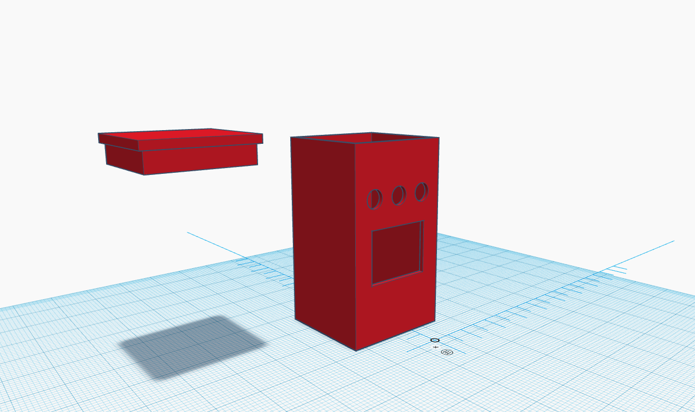
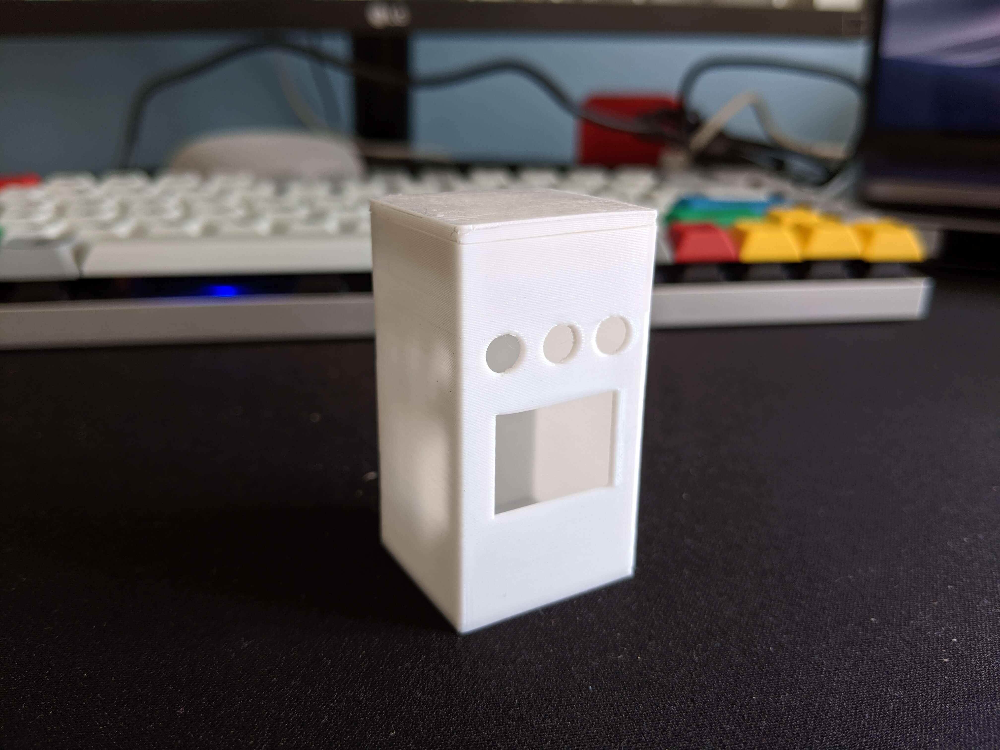
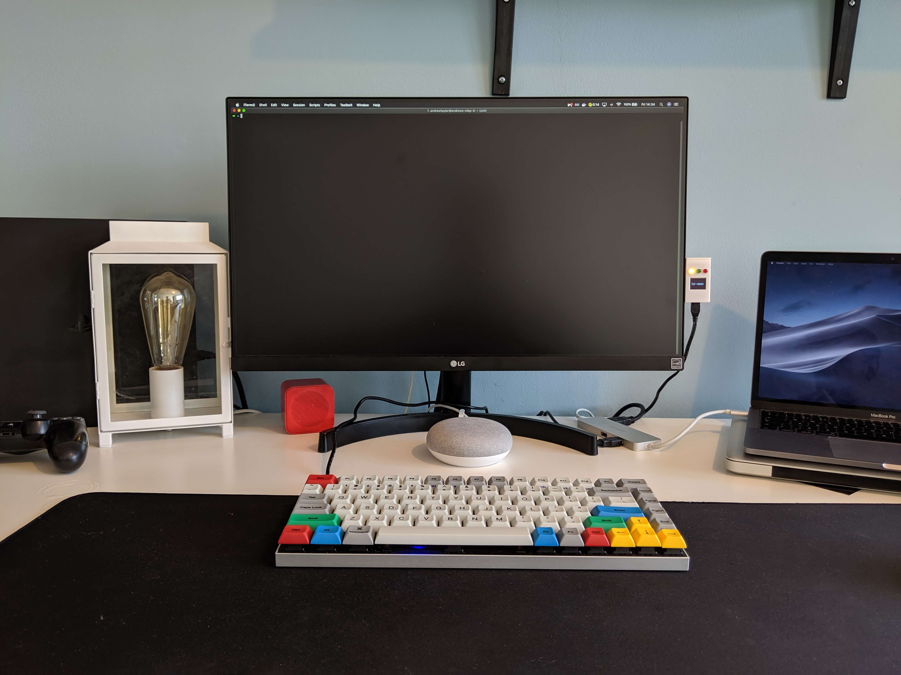

# Travis CI Monitor Alarm
Aim: To use an ESP8266 to monitor [Travis CI](https://www.travis-ci.com) builds and provide updates on a mini display.

## Required Components

In order to achieve my goal I required the following components:
- Green LED
- Red LED
- Yellow LED
- Piezo buzzer
- ESP8266 chip - [Wemos D1 mini pro](https://wiki.wemos.cc/products:d1:d1_mini_pro)
- ESP8266 [OLED shield](https://wiki.wemos.cc/products:d1_mini_shields:oled_shield)

## Proof of concept

I began by wiring up a proof of concept to ensure I could correctly control the various components. Connected each LED to a different digital pin and ground on the wemos (using resistors to limit the current). I did the same with the piezo buzzer. The OLED shield connects to the Wemos, and uses two of the digital pins on the Wemos.

            
## Code
The code connects to WiFi, and periodically hits Travis, checking for builds which are currently running. If builds are detected, the number of builds are displayed on the OLED screen and the amber LED lights up. If one of these builds disappears from the list of running builds, the code hits travis, to determine whether it passed or failed. If it passed, the green light is lit, if it passed, the red light is lit. In either scenario the name of the github username of the commit author is displayed on the OLED screen for a few seconds.

## Casing
I decided I'd like to make a casing to hold the components. I had never done this before. A quick Google led me to [Tinkercad](https://www.tinkercad.com). Although this is fairly light compared tosome other CAD software available, it is fairly straight forward to use, and was perfect for what I wanted to do.

Once I had created the design, I exported it and submitted it to [3d Hubs](https://3dhubs.com). An expert reviewed my design and confirmed that printing it was indeed feasible, and provided a quote. I proceeded to pay, choosing the colour and that was it! The service provided by [3d Hubs](https://3dhubs.com) was exceptional.

            
## Final Touches
The next step was to solder the circuit, removing the necessity for the breadboard, and inserting the finished circuit into the 3D printed case

## Finished Product
And there we have it - a travis build monitor made from an ESP8266 chip. I keep it attached to the side of my monitor:

[Here's what it looks like in action](./img/travis-compressed.mp4). At the point where I turn the device on there are no builds running. After a few seconds I trigger a build. Then, after some more time has passed I cancelled the build. This is all represented on the Travis monitor:
